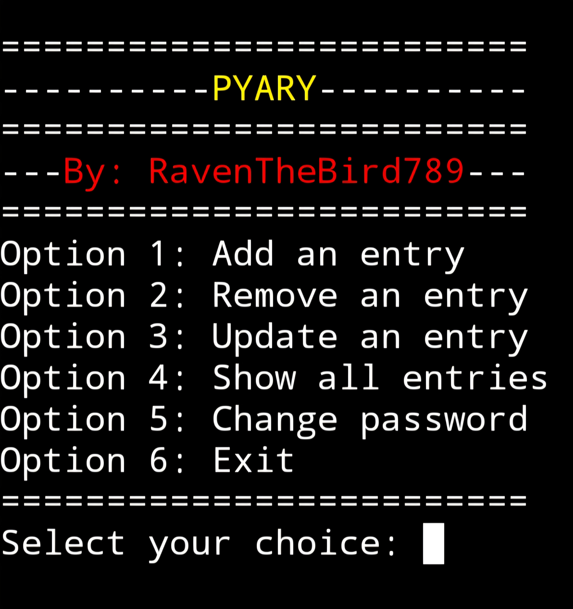
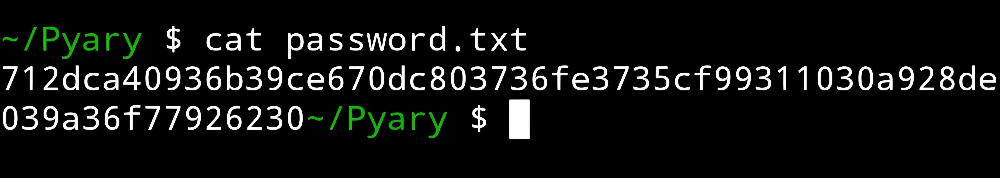

# Pyary 🐍📖✍️
Python script for a diary that operates in the CLI that allows users to add entries, remove entries, and update already existing entries through file manipulation via the python built-in os library



Installation

```bash
git clone https://github.com/RavenTheBird789/Pyary
```

Execution

To run

```bash
python3 diary.py
```

Optional shortcut

```bash
alias run="python3 diary.py"
```

Updates
* Password authentication included for diary access. Password security utilizes the built-in hashlib library to hash the users password with SHA256



* Option to change password added to the diaries UI (Option 5)
